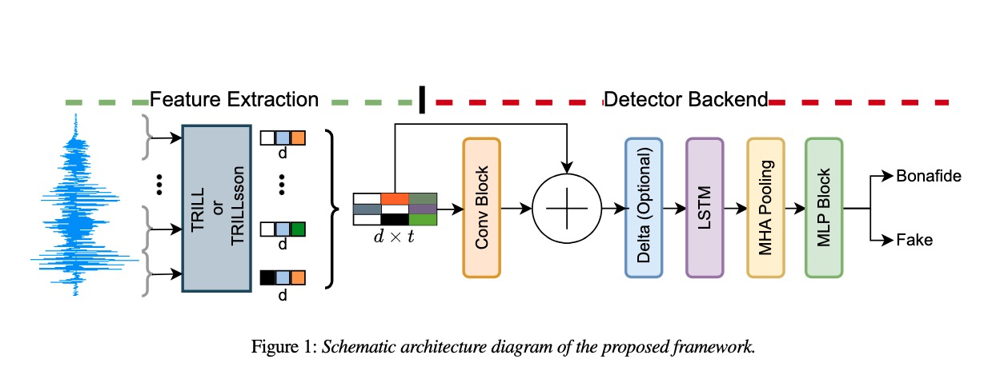
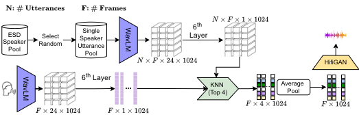
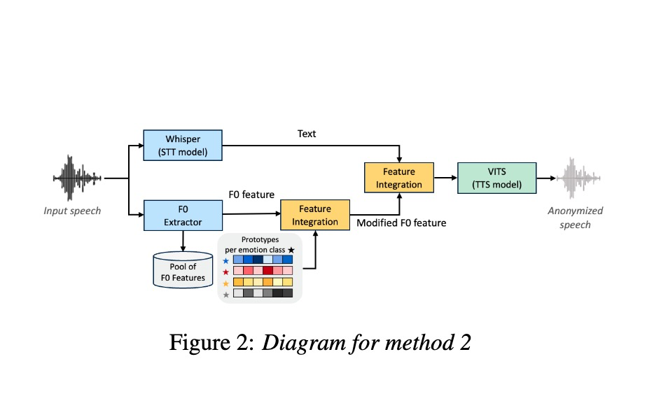

# Publications

## 2025

    

        
    

    

        <h3 class="publication-title">
            <a href="https://arxiv.org/abs/2509.00186" class="publication-link">
                Generalizable Audio Spoofing Detection using Non-Semantic Representations
            </a>
        </h3>
        

        
Arnab Das, Yassine El Kheir, Carlos Franzreb, Tim Herzig, Tim Polzehl, Sebastian Möller

        
2025

        

            Synthesis Detection
            <a href="https://arxiv.org/abs/2509.00186">ARXIV</a>
        

    

## 2024

    

        
    

    

        <h3 class="publication-title">
            <a href="https://www.researchgate.net/profile/Arnab-Das-30/publication/383435020_Comparing_Speech_Anonymization_Efficacy_by_Voice_Conversion_Using_KNN_and_Disentangled_Speaker_Feature_Representations/links/66cdca8cdaf28b7daf3fd80d/Comparing-Speech-Anonymization-Efficacy-by-Voice-Conversion-Using-KNN-and-Disentangled-Speaker-Feature-Representations.pdf" class="publication-link">
                Comparing Speech Anonymization Efficacy by Voice Conversion Using KNN and Disentangled Speaker Feature Representations
            </a>
        </h3>
        
Voice Privacy Challenge 2024

        
Arnab Das, Carlos Franzreb, Tim Herzig, Philipp Pirlet, Tim Polzehl

        
2024

        

            Speech Synthesis
            <a href="https://www.researchgate.net/profile/Arnab-Das-30/publication/383435020_Comparing_Speech_Anonymization_Efficacy_by_Voice_Conversion_Using_KNN_and_Disentangled_Speaker_Feature_Representations/links/66cdca8cdaf28b7daf3fd80d/Comparing-Speech-Anonymization-Efficacy-by-Voice-Conversion-Using-KNN-and-Disentangled-Speaker-Feature-Representations.pdf" class="tag tag-arxiv">Voice Privacy Challenge</a>
        

    

    

        
    

    

        <h3 class="publication-title">
            <a href="https://www.voiceprivacychallenge.org/vp2024/docs/T30_____V-Beam_____System_Description_for_Voice_Privacy_Challenge_2024.pdf" class="publication-link">
                System description for Voice Privacy challenge 2024
            </a>
        </h3>
        
Voice Privacy Challenge 2024

        

        
2024

        

            Speech Synthesis
            <a href="https://www.voiceprivacychallenge.org/vp2024/docs/T30_____V-Beam_____System_Description_for_Voice_Privacy_Challenge_2024.pdf" class="tag tag-arxiv">Voice Privacy Challenge</a>
        

    

    

        
    

    

        <h3 class="publication-title">
            <a href="https://www.isca-archive.org/interspeech_2024/polzehl24_interspeech.pdf" class="publication-link">
                Towards Classifying Mother Tongue from Infant Cries-Findings Substantiating Prenatal Learning Theory.
            </a>
        </h3>
        
INTTERSPEECH 2024

        
Tim Polzehl, Tim Herzig, Friedrich Wicke, Kathleen Wermke, Razieh Khamsehashari, Michiko Dahlem, Sebastian Möller

        
2024

        

            Voice System
            <a href="https://www.isca-archive.org/interspeech_2024/polzehl24_interspeech.pdf" class="tag tag-arxiv">ISCA Archive</a>
            <a href="https://github.com/timherzig/infant_cry" class="tag tag-github">GITHUB</a>
        

    

## 2023

    

        
    

    

        <h3 class="publication-title">
            <a href="https://arxiv.org/abs/2311.16829" class="publication-link">
                Decomposer: Semi-supervised Learning of Image Restoration and Image Decomposition
            </a>
        </h3>
        

        
Boris Meinardus, Mariusz Trzeciakiewicz, Tim Herzig, Monika Kwiatkowski, Simon Matern, Olaf Hellwich

        
2023

        

            Computer Vision
            <a href="https://arxiv.org/abs/2311.16829" class="tag tag-arxiv">ARXIV</a>
            <a href="https://github.com/timherzig/decomposition_learning" class="tag tag-github">GITHUB</a>
        

    

## 2022

    

        
    

    

        <h3 class="publication-title">
            <a href="https://arxiv.org/abs/2204.00770" class="publication-link">
                Speaker adaptation for Wav2vec2 based dysarthric ASR
            </a>
        </h3>
        
INTERSPEECH 2022

        
Murali Karthick Baskar, Tim Herzig, Diana Nguyen, Mireia Diez, Tim Polzehl, Lukáš Burget, Jan "Honza'' Černocký

        
2022

        

            ASR
            <a href="https://arxiv.org/abs/2204.00770" class="tag tag-arxiv">ARXIV</a>
            <a href="https://github.com/creatorscan/Dysarthric-ASR" class="tag tag-github">GITHUB 1</a>
            <a href="https://github.com/timherzig/asr_dysarthria" class="tag tag-github">GITHUB 1</a>
        

    

